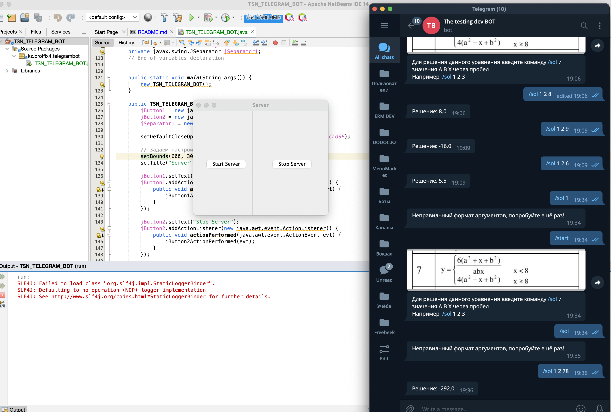

# ERM_Z2_TELEGRAM_BOT
Реализация бота для Telegram на Java в NetBeans для решения примера 

https://core.telegram.org/bots

https://core.telegram.org/bots/api

https://tlgrm.ru/docs/bots

https://tlgrm.ru/docs/bots/api

https://github.com/rubenlagus/TelegramBots

https://repo1.maven.org/maven2/org/telegram/telegrambots/5.0.1/
