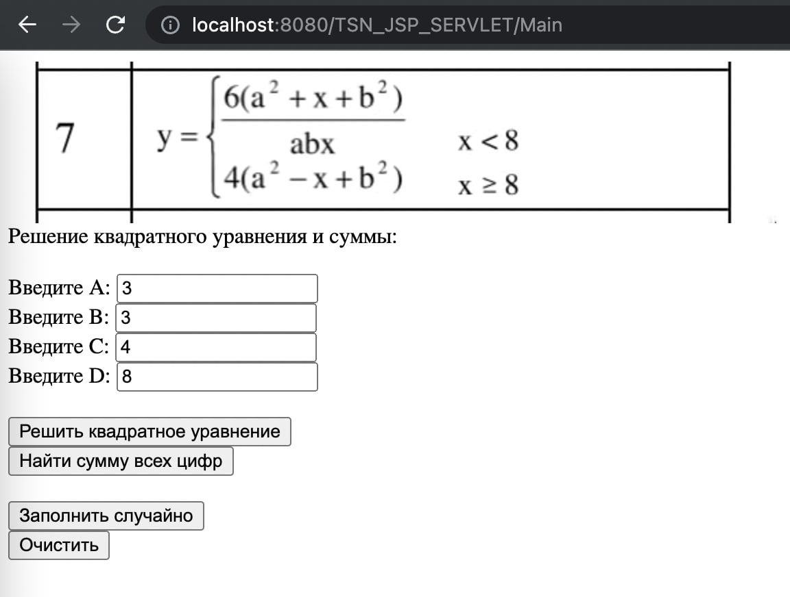
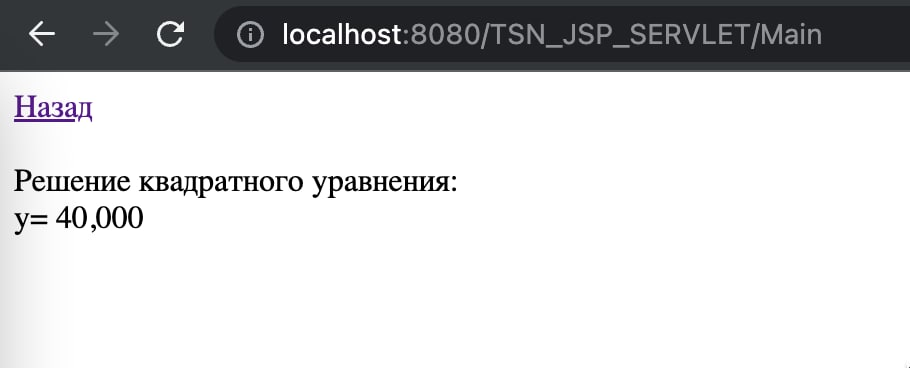
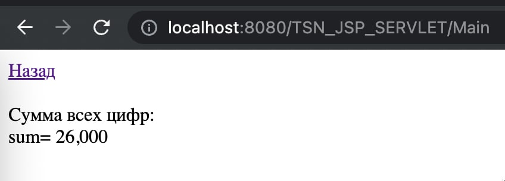

# ERM_JSP_SERVLET
Задание №3. Разработка сервлета

Разработать сервелет на Java для расчета математического значения по заданному алгоритму. 
Необходимо также реализовать отображение картинки задания, а также кнопу «Случайные значения» для инициализации входных переменных.

